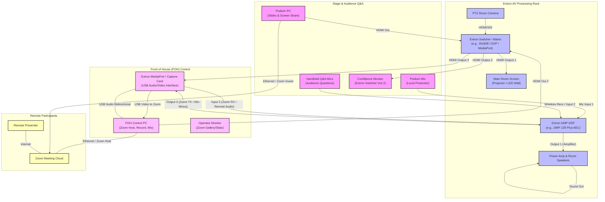

# Best Practice Guide: Zoom Hybrid Conference Setup (Extron Audio/Video Integration)
## FOH Control, Podium Presentation, and Handheld Q&A Management

This guide provides professional, industry-standard instructions for setting up, controlling, monitoring, and troubleshooting a hybrid conference using an **Extron AV System** (Extron Switcher and Extron DMP Audio DSP), a **Front of House (FOH) Computer** (for Zoom host, recording, and camera feed), and a **Podium Computer** (for screen sharing slides), with a dedicated **Handheld Microphone Q&A** setup.

---

## 1. System Architecture & Signal Flow

In a professional hybrid setup utilizing Extron hardware, video matrix switching and audio digital signal processing (DSP) manage the routing between the local room, the presenters, and the Zoom meeting.

### Extron AV Signal Flow Diagram

---

## 2. Extron DSP Audio Routing (Mix-Minus & AEC)

Acoustic feedback and echo occur when the remote presenter's voice is played through the room speakers, picked up by local mics (Podium or Handheld Q&A), and sent back to Zoom. The **Extron DMP Series DSP** must be configured with a **Mix-Minus** and **Acoustic Echo Cancellation (AEC)** matrix.

### Extron DMP Matrix Configuration Table

| DSP Input Channel | Source | Route to Room Speakers? (Amp Output) | Route to Zoom TX? (USB Send / Line Out to FOH) | AEC Configuration |
| :--- | :--- | :---: | :---: | :--- |
| **Input 1** | Local Podium Mic | **YES** | **YES** | **Enable AEC** |
| **Input 2** | Handheld Q&A Mic | **YES** | **YES** | **Enable AEC** |
| **Input 3** | Zoom RX (From USB Bridge/FOH PC) | **YES** | **NO (Mix-Minus)** | **Disable AEC** (Set as AEC Reference) |

### Acoustic Echo Cancellation (AEC) Setup
1. **Assign AEC Reference**: In the Extron DSP software (DSP Configurator), select the input channel associated with the **Zoom RX** (remote presenter audio) and assign it as the **AEC Reference** for Inputs 1 and 2.
2. **Double Processing Prevention**: On the FOH PC Zoom client, navigate to **Settings $\rightarrow$ Audio $\rightarrow$ Audio Profile**. Select **Zoom Optimized Audio**, but set Echo Cancellation to **Auto** or **Low**. This ensures Extron's hardware-based DSP handles the echo removal, preventing double-processing artifacting (which makes room voices sound underwater).
3. **Noise Gate & Ducking**: Enable a noise gate on the **Handheld Q&A Mics** in the DSP so they only unmute when spoken directly into. This prevents ambient room noise (and speaker reflections) from leaking into the Zoom session.

---

## 3. Extron Switcher Video Configuration

An Extron Switcher (e.g., IN1808, IN1608, or DXP Matrix) allows the FOH operator to dynamically control what displays in the room and what is sent to Zoom.

### Input/Output Mapping

* **Inputs**:
  1. **Podium PC HDMI** (Local Presentation Slides)
  2. **FOH PC Zoom HDMI Output** (Showing Spotlighted Remote Presenter or Gallery)
  3. **PTZ Room Camera** (Local Room Feed)
* **Outputs**:
  1. **Main Display / Projector** (Routes what the local audience sees)
  2. **Confidence Monitor** (Routes what the presenter on stage sees)
  3. **Capture Card / USB Bridge** (Routes what the Zoom remote audience sees)

### Room Scenarios & Switcher Presets

Configure three quick-recall presets on your Extron controller:

#### Preset 1: Local Presenter Mode
* **Main Room Display**: Routes **Input 1 (Podium PC)** so the local audience sees the slides.
* **Confidence Monitor**: Routes **Input 2 (FOH Zoom Out)** so the presenter can see remote participants.
* **FOH Capture (Zoom Feed)**: Routes **Input 3 (PTZ Camera)** so remote participants see the speaker on stage.
* *Note: Podium PC shares screen directly in the Zoom meeting.*

#### Preset 2: Remote Presenter Mode
* **Main Room Display**: Routes **Input 2 (FOH Zoom Out)** so the local audience sees the remote presenter projected full-screen.
* **Confidence Monitor**: Routes **Input 1 (Podium PC)** or **Input 3 (PTZ Camera)**.
* **FOH Capture (Zoom Feed)**: Routes **Input 3 (PTZ Camera)** so the remote presenter can see the room.

#### Preset 3: Active Q&A Mode
* **Main Room Display**: Routes **Input 2 (FOH Zoom Out)** so the audience can see the remote presenter responding.
* **Confidence Monitor**: Routes **Input 3 (PTZ Camera)** so the presenter can see the audience member asking the question.
* **FOH Capture (Zoom Feed)**: Routes **Input 3 (PTZ Camera)**. (PTZ camera operator should zoom in/pan to the audience member holding the handheld microphone).

---

## 4. Host & Presenter Settings

### FOH Computer (Zoom Host)
* **Audio Settings**:
  * Set Microphone to **Extron USB Audio** (or USB Bridge).
  * Set Speaker to **Extron USB Audio** (or USB Bridge).
* **Video Settings**:
  * Set Camera to **Extron USB Video** (or Capture Card).
* **Zoom Meeting Settings**:
  * Enable **Spotlight for Everyone** on the Remote Presenter.
  * Enable **Local High-Quality Recording** (ensure the path is on a fast, internal SSD with at least 50GB of free space).
  * Check **"Mute participants upon entry"** in the participants pane to prevent unexpected remote audio disruptions.
  * Assign **Co-host status** to the Podium PC and Remote Presenters before the event starts.
  * Keep Zoom Settings $\rightarrow$ General $\rightarrow$ **"Use dual monitors"** checked. Keep your dashboard and statistics on Screen 1, and the spotlighted remote presenter fullscreen on Screen 2 (HDMI out to Extron Switcher Input 2).

### Podium Computer (Presenter Slides)
* **Power & Sleep Settings**:
  - Keep the laptop plugged into AC power. Disable system sleep, screen savers, and automatic display turn-off during the presentation to prevent signal loss and EDID renegotiation.
* **Network Interface**:
  - **Hardwired Ethernet is mandatory**. Use a USB-to-Ethernet dongle and disable the laptop's Wi-Fi to force all traffic through the local gigabit switch.
* **Display Configuration**:
  - Configure the OS display settings to **Extend** the desktop, not Duplicate. This allows PowerPoint/Keynote Presenter View to run on the laptop screen while sending the clean, fullscreen slides to Extron Switcher Input 1.
* **Zoom Audio Setup**:
  1. Join the Zoom meeting.
  2. **MUST SELECT "Leave Computer Audio"** (click the arrow `^` next to the Mute/Audio icon and choose "Leave Computer Audio").
  3. Keep the physical laptop volume muted (set OS output to 0%).
* **Zoom Screen Sharing**:
  1. Share the presentation window.
  2. Uncheck "Optimize for video clip" unless active videos are playing in the presentation (unchecking ensures crisp slide text).

---

## 5. Control, Monitoring, and Q&A Playbook

### Active Q&A Management
* **Microphone Discipline**: The FOH operator must keep the wireless handheld mics muted on the physical mixer or DSP software until the speaker calls on an audience member.
* **Visual Cueing**: Ensure the PTZ camera is directed to the person asking the question before unmuting the handheld mic, so the remote presenter has a visual connection with the inquirer.
* **Echo Prevention**: Instruct the audience member to speak closely to the handheld mic (2-3 inches away) and stand clear of direct line-of-sight with the overhead/wall speakers.

### Monitoring Room Diagnostics & Zoom Dashboard

The FOH Operator must monitor Zoom's internal metrics to preemptively catch network degradation or hardware strain. Press `Ctrl + Alt + Shift + D` (Windows) or `Cmd + Option + Shift + D` (Mac) to keep the **Statistics** window open on the control screen.

#### Key Metrics to Track:

| Tab | Metric | Normal Range | Action Trigger / Troubleshooting |
| :--- | :--- | :--- | :--- |
| **Overall** | **Zoom CPU / Host CPU** | Zoom $< 40\%$, Host $< 80\%$ | If Host CPU exceeds 80%, close background apps (e.g., web browsers, OBS Studio preview, Dante Controller, or DSP Configurator). Reduce Zoom video resolution settings. |
| **Audio** | **Frequency / Jitter** | Frequency: 48 kHz / Jitter $< 30\text{ ms}$ | Jitter $> 30\text{ ms}$ indicates network congestion. Disable Wi-Fi and verify the FOH PC is running on hardwired Ethernet. |
| **Audio** | **Packet Loss** | $0.0\%$ to $< 1.0\%$ | Packet loss $> 2.0\%$ causes audio dropouts. Contact local IT to request Quality of Service (QoS) bandwidth priority for the Zoom PC. |
| **Video** | **Resolution** | 720p or 1080p (Send & Receive) | If resolution drops to 360p/180p, Zoom has throttled bandwidth. Check the network tab, disable HD video features in Zoom settings, or check for local bandwidth hogging. |
| **Video** | **Frame Rate (FPS)** | 24 to 30 FPS | If FPS drops below 15, the video will appear choppy. Check CPU load and USB controller bandwidth (ensure capture card is on a USB 3.0 port). |

---

### Zoom Spotlighting & Pinning Rules

For hybrid events, FOH must distinguish between local screen routing (**Pinning**) and what the remote audience sees (**Spotlighting**).

* **Pinning (Local View Only)**:
  - Pinning a participant only changes the display on the FOH computer. It does *not* affect other participants or the recording.
  - Use Pinning to monitor specific remote presenters or the room's backup camera feed on the FOH control screen.
* **Spotlighting (Remote Audience View)**:
  - Spotlighting a participant makes them the main video for all meeting attendees and forces their video onto the FOH HDMI output routed to the Extron Switcher (and thus the room projector).
  - **Single Spotlight**: Spotlight the Remote Presenter when they are speaking so the local audience and remote audience see them full-screen.
  - **Multi-Spotlight**: Zoom supports spotlighting up to 9 participants simultaneously. For interactive Q&A sessions, spotlight **both** the Remote Presenter and the Room PTZ Camera (FOH PC host feed). This allows remote participants to see the local audience member asking the question side-by-side with the presenter.

---

### FOH Comm & Audio Intercom Isolation

To ensure smooth operations, FOH operators must use intercom systems (e.g., Clear-Com, Unity, or RTS) to coordinate with camera operators and podium wranglers.
* **Zero-Crosstalk Rule**: Under no circumstances should the FOH Zoom computer or the Extron DSP receive audio from the intercom lines.
* **Hardware Isolation**: Run the intercom on a completely separate physical ring-line or wireless frequency.
* **Operational Feedback**: The FOH operator should have the "Shadow PC" auditor on an intercom headset, so the auditor can instantly whisper audio corrections ("Remote presenter's voice is low in the room", "Handheld Mic 2 has digital clipping") without interrupting FOH workflow.

---

### Monitoring Outgoing Video & Audio (What Zoom is Sending)

To guarantee the remote audience receives high-quality feeds, the FOH operator should utilize three layers of monitoring:

#### 1. Outgoing Audio Monitoring
* **A. Extron DSP Monitor Bus (Hardware Level)**:
  - Plug closed-back monitor headphones (e.g., Sennheiser HD 280 Pro) into the headphone jack of the Extron DSP or the USB Audio Bridge interface.
  - In the Extron DSP Configurator, route the **Zoom TX (Transmit)** bus to this monitor channel. This lets you hear exactly what room audio is being sent to Zoom (podium mic + Q&A mics, after noise gates/EQ) *without* hearing the remote presenter's voice (preventing self-echo).
* **B. Zoom Input Meter (Software Level)**:
  - In the FOH Zoom client, navigate to **Settings $\rightarrow$ Audio**.
  - Monitor the **Input Level** meter. The green bar should peak at 50–70% when room presenters talk. If the bar is solid green, the audio is clipping/distorting. If it doesn't move, Zoom is not receiving the Extron audio feed.
* **C. The "Shadow PC" Auditor (Operational Level - Gold Standard)**:
  - Assign a co-organizer in another room (or at the back of the hall) to join the Zoom meeting on a separate laptop (the "Shadow PC").
  - **CRITICAL**: The Shadow PC must have its mic muted and speaker/computer audio **completely disconnected** (or outputting only to headphones).
  - The auditor monitors the live stream in real-time, checking for audio clarity, dropouts, or volume imbalances, and reports issues to FOH via intercom/chat.

#### 2. Outgoing Video Monitoring
* **A. Zoom "Self-View" Pin (Software Level)**:
  - On the FOH PC control monitor, keep the Zoom meeting's **"Self View"** active and pinned. 
  - This shows exactly what is coming from the Extron switcher via the USB capture device, allowing you to instantly verify camera framing, focus, and switcher routes.
* **B. OBS Studio / Utility Software Preview (Hardware Bypass)**:
  - Run a lightweight video utility (like OBS Studio or the capture card's preview utility) on the FOH PC.
  - Previewing the raw capture card feed helps isolate issues: if OBS shows a clean camera feed but Zoom is black, the issue is software-based; if both are black, the issue is the Extron switcher or HDMI cable.
* **C. Shadow PC Video Verification (Operational Level)**:
  - The Shadow PC auditor verifies that the remote presenter is correctly spotlighted, that the local room camera feed is clear, and that any slides shared from the Podium PC are legible and uncompressed.

---

## 6. Troubleshooting Extron Setup

| Issue / Symptom | Likely Cause | Step-by-Step Resolution |
| :--- | :--- | :--- |
| **Remote presenter hears a delayed echo of their own voice.** | The Extron DSP is routing Zoom RX audio back into the Zoom TX line, or a device is unmuted. | 1. Open Extron DSP Configurator. Double-check that the **Zoom RX Input** crosspoint to **Zoom TX Output** is fully muted (Mix-Minus fail). 2. Ensure the **AEC Reference** is assigned to the Zoom RX input channel. 3. Verify the Podium PC has "Left Computer Audio" completely. |
| **A loud feedback squeal occurs when the handheld Q&A mic is unmuted.** | The handheld microphone is gain-staged too high, or is too close to a room speaker. | 1. Immediately mute the handheld channel in the DSP/mixer. 2. Lower the channel gain / fader in the Extron DSP Configurator. 3. Ensure the noise gate threshold is set correctly so the mic doesn't pick up speaker reflections. 4. Move the audience member away from the local speaker zone. |
| **No audio from the remote presenter can be heard in the room.** | Zoom is outputting to the wrong device, or Extron line routing is down. | 1. In Zoom audio settings, verify **Speaker** is set to the Extron USB device. 2. In the OS volume mixer, ensure the output device is not muted and volume is at 100%. 3. On the Extron DSP, verify the input meter for the Zoom channel is bouncing. If it is, check the routing crosspoint to the Room Amplifier Output and turn up the level. |
| **The video switcher displays a black screen or "No Signal" on the projector.** | HDMI handshake issue (EDID mismatch) or incorrect switcher input routed. | 1. Open the Extron switcher control utility (or front panel) and verify EDID emulation is enabled on all inputs (set inputs to 1080p @ 60Hz). 2. Disconnect and reconnect the HDMI cables to re-trigger the handshake. 3. Verify the FOH computer is set to "Extend these displays" (not duplicate) and the resolution matches the switcher input. |
| **The remote presenter's video is lagging or pixelated.** | Network packet loss or bandwidth limits. | 1. Ensure both FOH and Podium PCs are on **hardwired ethernet** (disable Wi-Fi on both). 2. In Zoom Settings $\rightarrow$ Video, turn off **"HD Video"** to lower the bandwidth load on poor connections. 3. Check Zoom statistics to identify packet loss. |

---

## 7. Podium Computer Troubleshooting & Checklist

When presenting from a podium laptop (Windows or macOS), technical issues can disrupt the schedule. Use this quick-action checklist at the podium to resolve common issues under pressure.

### A. Display & Signal Issues (Black Screen / "No Signal" on room screens)
* **Symptom**: Laptop screen is active, but Room Projector/Confidence Monitor shows "No Signal" or black screen.
* **Troubleshooting Steps**:
  1. **Check Dongle/Connection**:
     - Ensure USB-C to HDMI adapters or dongles are fully seated.
     - Unplug the HDMI cable from the laptop, wait 5 seconds, and replug it to force an EDID renegotiation.
  2. **Force Display Settings**:
     - **Windows**: Press `Win + P` and select **Extend** (preferred) or **Duplicate**.
     - **macOS**: Go to **System Settings $\rightarrow$ Displays**. Click the **+** dropdown or **Arrange** to ensure the Extron Switcher is recognized as an external display.
  3. **Resolution & Refresh Rate Alignment**:
     - Switch the laptop's external display output to **1920x1080 @ 60Hz**. High-refresh-rate outputs (e.g., 120Hz or 144Hz on gaming laptops) or 4K resolution can fail to negotiate through standard Extron switchers.
  4. **HDCP Block**:
     - Some streaming apps (e.g., Netflix, Apple TV, or copyright-protected video elements inside slides) trigger HDCP protection, causing the switcher to output a black screen. Close any protected content.

### B. Audio Leakage & Echo
* **Symptom**: A loud howling/feedback loop starts when the Podium PC shares screen or presenter talks.
* **Troubleshooting Steps**:
  1. **Leave Computer Audio**:
     - In the Zoom interface, look at the bottom-left corner. If you see a microphone icon (even if muted), the laptop is still connected to the meeting's audio bridge.
     - Click the arrow `^` next to the Mute button and select **"Leave Computer Audio"**. The icon must change to a **Join Audio (headphones with green arrow)** symbol.
  2. **System Speaker Mute**:
     - Physically mute the laptop's built-in speakers (set OS volume to 0%). This acts as a secondary layer of protection in case someone accidentally joins computer audio.

### C. macOS Screen Sharing Block (Security Permissions)
* **Symptom**: Presenter clicks "Share Screen" in Zoom but gets a permission error or shares a blank/desktop-only screen.
* **Troubleshooting Steps**:
  1. Navigate to **System Settings $\rightarrow$ Privacy & Security $\rightarrow$ Screen & System Audio Recording**.
  2. Locate **zoom.us** in the list and toggle the switch to **ON**.
  3. If prompted to quit Zoom to apply changes, click **Quit & Reopen**. 
  4. *Note*: FOH must immediately re-assign Co-Host privileges to the presenter when they re-enter the meeting.

### D. Slideshow Presentation View Mismatch
* **Symptom**: The presenter's notes/next slides (Presenter View) are showing on the room projector, or Zoom remote participants are looking at the PowerPoint edit view rather than the fullscreen presentation.
* **Troubleshooting Steps**:
  1. **PowerPoint Settings**:
     - Open PowerPoint $\rightarrow$ Go to the **Slide Show** tab.
     - Locate the **Monitor** dropdown. Change it from **Automatic** or **Primary Monitor** to the external display (often labeled "Display 2" or "Extron Switcher").
     - Toggle the **"Use Presenter View"** checkbox to match the presenter's preference (checked: notes on laptop, slides on screens; unchecked: full slides on both).
  2. **Zoom Share Window Selection**:
     - Start the PowerPoint slide show first (F5 or Slide Show button).
     - Press `Alt + Tab` (Windows) or `Cmd + Tab` (macOS) to switch back to Zoom.
     - Click **Share Screen**. In the selection window, choose the window titled **"PowerPoint Slide Show - [Filename]"** instead of sharing the main PowerPoint application or the entire desktop.
  3. **Keynote (macOS) Slide Show Settings**:
     - Go to Keynote $\rightarrow$ Settings $\rightarrow$ Slideshow.
      - Check **"Enable Presenter Display"** and assign it to the built-in screen, setting the slideshow to the secondary display.

### E. Remote Presenter Can See the Room but Cannot Hear It (Fed via Podium PC)
* **Symptom**: The remote presenter is receiving the room PTZ camera feed through the Podium PC, but they report absolute silence (no podium mic or audience question mics).
* **Troubleshooting Steps**:
  1. **Zoom Microphone Selection**:
     - On the Podium PC, click the arrow `^` next to the Microphone icon in Zoom and verify the selected Microphone input is **Extron USB Audio** (or USB Bridge / MediaPort), rather than "Built-in Microphone" or "Same as System".
     - Speak into the podium mic and check if the green microphone level indicator in Zoom's settings is bouncing.
  2. **USB Port and Cable Audit**:
     - Ensure the USB cable connecting the Extron MediaPort/Capture Card to the Podium PC is plugged into a USB 3.0 port (typically blue or marked with an SS symbol). USB 2.0 ports can run out of bandwidth and fail to initialize the audio stream while still allowing video.
     - Unplug and replug the USB cable to force the OS to re-initialize the audio driver.
  3. **Extron DSP Transmit (TX) Verification**:
     - Check the Extron DSP Configurator software. Verify the Podium Mic and Handheld Mic channels are routed (crosspoints closed) to the output channel feeding the USB Bridge (e.g., Output 3).
     - Ensure the transmit level fader is not muted or set to $-\infty$ dB.
  4. **OS Level Microphone Privacy settings**:
     - **Windows**: Go to Settings $\rightarrow$ Privacy & Security $\rightarrow$ Microphone. Verify "Microphone access" is toggled ON and "Let desktop apps access your microphone" is enabled for Zoom.
     - **macOS**: Go to System Settings $\rightarrow$ Privacy & Security $\rightarrow$ Microphone. Ensure Zoom is toggled ON.
  5. **Operational State Check (FOH vs. Podium Audio Host)**:
     - **If FOH PC is running Zoom**: The Podium PC **must** remain in the "Leave Computer Audio" state. The remote presenter should be hearing the room audio fed by the **FOH PC** Zoom host. If they can't hear the room, verify FOH PC's audio settings, not the Podium PC's.
     - **If there is no FOH PC (Podium PC is the sole Zoom connection)**: The Podium PC **must** join audio and use the Extron USB device. Do not select "Leave Computer Audio".

### F. Room Can See Remote Presenter but Cannot Hear Them (Fed via Podium PC to Projector)
* **Symptom**: The remote presenter's video is projected on the room screen (fed via the Podium PC's HDMI output), but the local audience cannot hear the remote presenter's voice through the room speakers.
* **CRITICAL ARCHITECTURAL DECISION (Determine Setup Type)**:
  Before changing any audio settings, check if the **FOH PC** is active in the Zoom meeting:
  
  * **Option 1: DUAL PC SETUP (FOH PC + Podium PC are both in the meeting)**
    - **Expected State**: The Podium PC **must remain on "Leave Computer Audio"**. Audio should NOT come from the Podium PC.
    - **Troubleshooting Steps**:
      1. Go to the **FOH PC** (Zoom Host). Verify FOH PC is connected to the Zoom audio bridge (**Join Audio** $\rightarrow$ **Computer Audio**).
      2. Verify FOH PC's Zoom Speaker Output is set to **Extron USB Audio** (or USB Bridge).
      3. Open the **Extron DSP Configurator** and check the input channel mapped to **Zoom RX (DSP Input 3)**. Verify the crosspoint to **Output 1 (Room Speakers)** is closed and not muted.
      
  * **Option 2: SINGLE PC SETUP (Podium PC is the only system connected to Zoom)**
    - **Expected State**: The Podium PC **must join audio** to feed the room speakers via its HDMI line.
    - **Troubleshooting Steps**:
      1. **Join Audio**: Check the bottom-left corner of Zoom on the Podium PC. If it shows a headphones icon labeled **"Join Audio"**, click it and select **Join Computer Audio**.
      2. **Zoom Speaker Output**: Click the arrow `^` next to the Microphone/Audio button in Zoom on the Podium PC. Ensure the Speaker is set to the **HDMI Output** (e.g., Extron Switcher, Projector, or Intel/AMD/Apple Display Audio), NOT the laptop's internal speakers.
      3. **Laptop System Volume**: Ensure the OS volume on the Podium laptop is unmuted and set to 80-100%.
      4. **Extron Switcher & DSP Routing**:
         - Open the Extron DSP Configurator.
         - Locate the input channel for **Switcher Input 1 Audio** (Podium PC HDMI Audio) or the corresponding analog/digital input from the switcher.
         - Verify the routing crosspoint to **Output 1 (Room Amplifier / Speakers)** is closed and the level fader is set to unity ($0$ dB) or appropriate gain.
